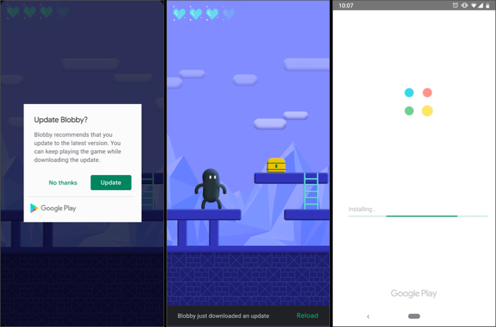
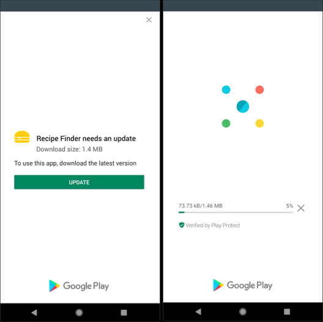

# AppVersion BroadcastReceiver Example
Support in app updates it's show's update popup when new update is available in play store 
and also auther example BroadcastReceiver when new version of app get's installed or also 
notify when new version of app get's installed.

### Reference:-

https://developer.android.com/guide/app-bundle/in-app-updates

## Screenshots:-

